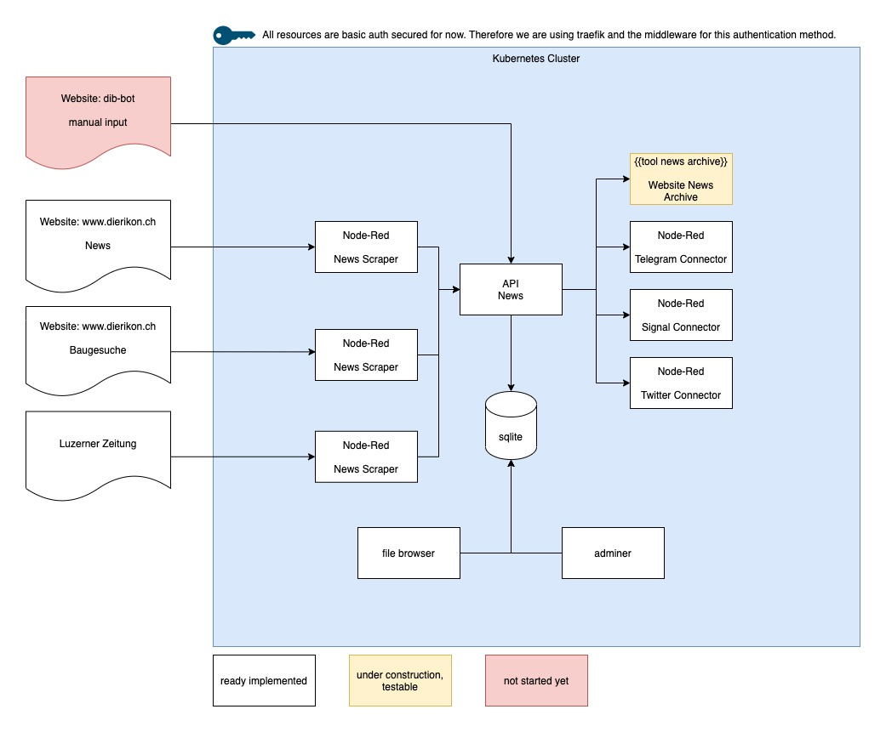
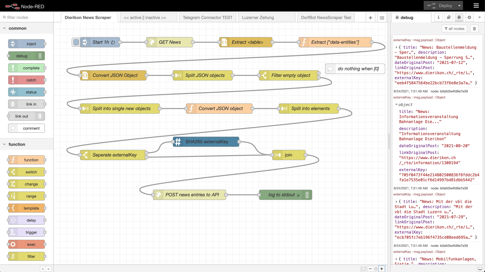

# Dorf Info Bot (DIB)

The goal of the Dorf Info Bot (DIB) project is, to enhance information distribution for small villages and cities. Information such as the news from the communities website, websites from local associations, etc. are bundled and broadcasted via different channels. The setup is created to be very flexible.



The central part is an API that collects news and saves them to a database. For now, this is Sqlite. This API is done with ASP .NET Core and Entity Framework, so Database changes should be quite easy in the future if required. You can find the source code for that API in this repository. A Swagger API documentation is included and automatically created.

Input is generated by News Scrapers. I decided to not implement them by code, because they are very different for each use case and might change frequently. So I opted for a [Node Red](https://nodered.org/) based solution, which is super flexible and easy to create and change for every use-case.



The same is done for the channel connectors for Telegram and other channels. As they might differ from use case to use case and can be implemented differently, I opted here too for Node-Red. The combination of the central API which can easily be accessed from any Node-Red component and the flexibility of Node-Red itself has proven to be a very flexible system architecture decision (so far ;-)).

You can find some examples of Node-Red Flows in the [attachment/node-red-flows](attachment/node-red-flows) folder.

## Quickstart

Run the api tool locally for testing / development:

- git clone this repo `git clone git@github.com:JamborJan/DorfInfoBot.git`
- set your data directory via ENV `DorfInfoBot.API__DataFilesPath`=`/data/` (or adjust appsettings.Development.json)
- execute `dotnet run --project src/DorfInfoBot.API/DorfInfoBot.API.csproj`
- for tests execute `dotnet test`

You can make use of the provided Dockerfile and Pipeline and create your own image. When running as container, provide ENV `DorfInfoBot.API__DataFilesPath`=`/data/`.

## Infrastructure

The app is located in a running and ready configured Kubernetes clsuter. We assume that Ingress with traefik is working.

Namespace: `ns-dorf-info`
Configs: `sec-dorf-info-ba`

Traefik middleware:

```yaml
# # # # # # # # # # # # # # #
# Middleware BasicAuth for all (MIG, TRN, PRD)
apiVersion: traefik.containo.us/v1alpha1
kind: Middleware
metadata:
  name: auth-dorf-info
  namespace: ns-dorf-info
spec:
  basicAuth:
    secret: sec-dorf-info-ba
```

URLs:

- File: file-dib.your.domain.com
- Adminer: db-dib.your.domain.com
- API: api-dib.your.domain.com
- Noder-Red: nr-dib.your.domain.com

```yaml
traefik.ingress.kubernetes.io/router.tls: true
traefik.ingress.kubernetes.io/router.tls.certresolver: myresolver
traefik.ingress.kubernetes.io/router.entrypoints: websecure
traefik.ingress.kubernetes.io/router.middlewares: ns-dorf-info-auth-dorf-info@kubernetescrd
```

## Security

All resources are basic auth secured for now. Therefore we are using traefik and the middleware for this authentication method. At a later stage, this decision must be challenged.

## Supporting applications

### web file viewer

Based on [file-explorer](https://github.com/adrientoub/file-explorer) (Docker Hub: [file-explorer](https://hub.docker.com/search?q=fileexplorer&type=image)).

Create a new instance of the tool in Portainer:

- Name: `filebrowser`
- Image: `filebrowser/filebrowser:v2.16.0`
- Namespace: `ns-dorf-info`
- Stack: `dib`
- Environment variables: `FB_NOAUTH` : `TRUE`
- Persisting data: path: `/srv`; (new volume, used in all applications here)
- Resources: CPU 0.1; Memory 64 MB
- Publishing the application: container port: 80; hostname: file-dib.your.domain.com; route: /

### adminer

Create a new instance of the tool in Portainer:

- Name: `adminer`
- Image: `adminer:4.8.1`
- Namespace: `ns-dorf-info`
- Stack: `dib`
- Environment variables: keine (wäre möglich hier: `ADMINER_DEFAULT_SERVER` : `mysql`)
- Persisting data: path: `/data`; (existing volume, used in all applications here)
- Resources: CPU 0.1; Memory 64 MB
- Publishing the application: container port: 8080; hostname: db-dib.your.domain.com; route: /

After the container is started do:

- ssh into it and `cat > /var/www/html/plugins-enabled/login-password-less.php`

```php
<?php
require_once('plugins/login-password-less.php');

/** Set allowed password
  * @param string result of password_hash
  */
return new AdminerLoginPasswordLess(
  $password_hash = password_hash("admin", PASSWORD_DEFAULT)
);
```

- after that you can login with user and password `admin` into the sqlite3 db

### node-red

Create a new instance of the tool in Portainer:

- Name: `nodered`
- Image:
  - Default: `nodered/node-red:2.0.5-14`
  - Custom one if you want to use e.g. Signal-Cli in for sending messages
- Namespace: `ns-dorf-info`
- Stack: `dib`
- Environment variables:
  - `LANG` : `de_DE.UTF-8`
- Persisting data: 
  - path: `/data`; (existing volume, used in all applications here)
  - path: `/usr/src/node-red/.local/share`; (only if you are using Signal-Cli, new or a dedicated existing volume)
- Resources: CPU 0.2; Memory 512 MB
- Publishing the application: container port: 1880; hostname: nr-dib.your.domain.com; route: /

### dib api

Create a new instance of the tool in Portainer:

- Name: `dorf-info-api`
- Image: `jjscontainers.azurecr.io/dib:1604`
- Namespace: `ns-dorf-info`
- Stack: `dib`
- Environment variables: keine
- Persisting data: path: `/data`; (existing volume, used in all applications here)
- Resources: CPU 0.2; Memory 512 MB
- Publishing the application: container port: 80; hostname: api-dib.your.domain.com; route: /
